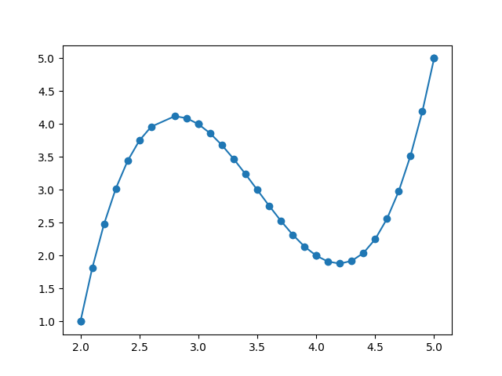

# Линейная интерполяция на неравномерной сетке:  
## Как запускать программу?
1) Введите размер n вектора x,y  
2) Введите размер m вектора mid(внутреннее значение вектора x)  
3) Введите поэлементно значения вектора x, y по очереди  
Пример:  
x_1:1  
y_1:2.5  
x_2:3  
y_2:3.5  
...  
4) Введите значения вектора mid  
## Что выводит программа?  
Программа выводит вектор mid_y(Посчитанный через линейную интерполяцию) и график.
  
### Пример:  
Введите длину вектора x,y:  
4  
Введите длину вектора внутренних значений x:  
3  
x_ 1 :  
2  
y_ 1 :  
1  
x_ 2 :  
3  
y_ 2 :  
4  
x_ 3 :  
4  
y_ 3 :  
2  
x_ 4 :  
5  
y_ 4 :  
5  
Введи внутренние значения  
mid_ 1 :  
2.5  
mid_ 2 :  
3.5  
mid_ 3 :  
4.5  
[2.5 3.  3.5]  
### График  

# Интерполяция Лагранжа на неравномерной сетке
## Что выводит программа?  
Программа выводит вектор mid_y(Посчитанный через интерполяцию Лагранжа) и график.
### Прммер(Ввод mid):  
2.1 2.2 2.3 2.4 2.5 2.6 2.7 2.8 2.9 3.1 3.2 3.3  
3.4 3.5 3.6 3.7 3.8 3.9 4.1 4.2 4.3 4.4 4.5 4.6  
4.7 4.8 4.85 4.9 4.95 4.99  
  
### Пример(Вывод):   
[1.81     2.48     3.02     3.44     3.75     3.96     4.08     4.12  
 4.09     3.86     3.68     3.47     3.24     3.       2.76     2.53  
 2.32     2.14     1.91     1.88     1.92     2.04     2.25     2.56  
 2.98     3.52     3.838125 4.19     4.576875 4.912415]  
### График:

# Интерполяция сплайнами на равномерной сетке  
Программа выводит вектор mid_y(Посчитанный через интерполяцию сплайнами) и график.
### Прммер(Ввод mid):  
2.1 2.2 2.3 2.4 2.5 2.6 2.7 2.8 2.9 3.1 3.2 3.3  
3.4 3.5 3.6 3.7 3.8 3.9 4.1 4.2 4.3 4.4 4.5 4.6  
4.7 4.8 4.85 4.9 4.95 4.99  
  
### Пример(Вывод):   
[1.3      1.6      1.9      2.2      2.5      2.8      3.1      3.4
 3.7      4.085    4.08     3.995    3.84     3.625    3.36     3.055
 2.72     2.365    2.015    2.12     2.305    2.56     2.875    3.24
 3.645    4.08     4.305625 4.535    4.766875 4.953335]
### График:

